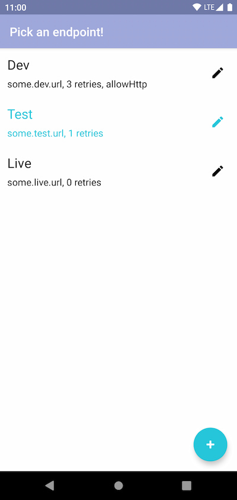

# EnvPicker

[](https://maven-badges.herokuapp.com/maven-central/de.br.android/envpicker)


An Android Library for in-app switching between environment variables.

Central use case is picking a desired endpoint for backend communication, but more complex data
structures can be handled as well. The app will restart after making a change.




## Setup

Include EnvPicker in your gradle build like this:

```groovy
repositories {
    mavenCentral()
}

dependencies {
    implementation 'de.br.android:envpicker:0.1.0'
}
```

## Usage

In simple cases the `KeyValueEntry` class can be used to save key-value pairs.

```kotlin
// Define the Endpoints that should be available per default
val defaultEndpoints =
    listOf(
        KeyValueEntry("Live", "some.live.endpoint.org"),
        KeyValueEntry("Dev", "some.dev.endpoint.org")
    )

// Init the library
val endpointPicker = envPicker(
    key = "keyValueEndpointsPicker", // Used as sharedPrefs key
    fragmentTitle = "Choose Endpoint", // Displayed as fragment title
    defaultEntries = defaultEndpoints, // Which Endpoints should be available per default?
    defaultActiveEntry = defaultEndpoints[0], // Which endpoint should be active initially?
    context = context,
)

// Initialization is done at this point. Now how to use the EnvPicker?

// Get current endpoint URL
val currentlyActiveEndpointUrl = endpointPicker.getActiveEntry(context).value

// Change active endpoint
endpointPicker.setActiveEntry(defaultEndpoints[1], context)

// Update endpoints list
endpointPicker.setEntries(
    defaultEndpoints + KeyValueEntry("Other", "another.url.com"),
    context
)

// Show management UI
endpointPicker.startEnvPickerActivity(context)

// Or get an equivalent fragment and handle it yourself
fragmentManager
    .beginTransaction()
    .add(endpointPicker.createFragment(), "endpointPicker")
    .commit()
```

## Advanced Usage

In order to support fields of types other than `String` or if more values are associated with an
entry, we need to use a custom data class which implements the `Entry` interface. The UI will
display appropriate input methods for each field. See the supported `FieldType`s below.

```kotlin
// A custom data class implementing the Entry interface
data class Endpoint(
    @EntryField("Name") // Each field needs this annotation to declare a label
    override val name: String, // Override the name field
    @EntryField("URL")
    val url: String,
    @EntryField("Retry Count")
    val retryCount: Int,
    @EntryField("Allow HTTP")
    val allowHttp: Boolean
) : Entry {

    // Optional: The summary of a given entry that is displayed in the UI
    override val summary: String
        get() = "$url, $retryCount retries" + if (allowHttp) ", allowHttp" else ""

    // Optional: Define a custom serializer, e.g. using GSON
    class Serializer : EntrySerializer<Endpoint> {
        override fun serializeEntry(entry: Endpoint): String = Gson().toJson(entry)
        override fun deserializeEntry(str: String): Endpoint =
            Gson().fromJson(str, Endpoint::class.java)
    }
}

// Use the custom data class
val defaultEndpoints =
    listOf(
        Endpoint("Live", "some.live.endpoint.org", 2, false),
        Endpoint("Dev", "some.dev.endpoint.org", 6, true)
    )

// Init the library
val endpointPicker = envPicker(
    key = "endpointsPicker", // Used as sharedPrefs key
    fragmentTitle = "Choose Endpoint", // Displayed as fragment title
    // Which Endpoints should be available per default?
    defaultEntries = defaultEndpoints,
    // Which endpoint should be active initially?
    defaultActiveEntry = defaultEndpoints[0],
    // Optional: Define a custom serializer
    customSerializer = Endpoint.Serializer(),
    context = context,
)

// Accessing the entry's fields now works with the custom field names
val currentlyActiveEndpointUrl =
    endpointPicker.getActiveEntry(context).url
val currentlyActiveEndpointRetryCount =
    endpointPicker.getActiveEntry(context).retryCount
```

### Supported FieldTypes

The currently supported types for custom data class fields are:

- String
- Int
- Boolean

## Obfuscation

In case you enable obfuscation through R8 and you are using a custom data class, the following needs
to be included in your rules:

```
-keep class <customClassQualifiedName> { *; }
```

## Contribute

Have a look at the [contribution guidelines](./CONTRIBUTING.md) to get started! Please also read
the [code of conduct](./CODE_OF_CONDUCT.md).

## Maintainers

- leonbusse

## License

Apache 2.0. See the [LICENSE](./LICENSE.txt) file for details.
